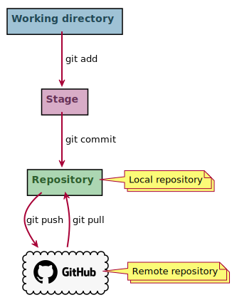
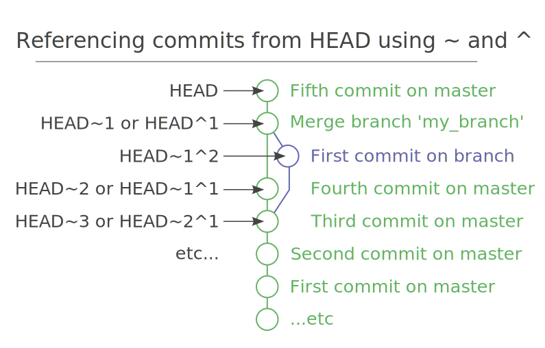

### Chapter1 – Overview

<p align="center">
    
<p>

- Image reference: [Corrigez vos erreurs sur votre dépôt local](https://openclassrooms.com/fr/courses/5641721-utilisez-git-et-github-pour-vos-projets-de-developpement/6112481-corrigez-vos-erreurs-sur-votre-depot-local)

#### Definition

The `HEAD` is a pointer to the current position in your git working directory. By default, HEAD points to the master branch and can be moved to another branch or to another commit.

- Tilde: `HEAD~` is shorthand for `HEAD~1`
- Caret: `HEAD^` is shorthand for `HEAD^1`



- Image reference: [Git caret and tilde | Paul Boxley](http://www.paulboxley.com/blog/2011/06/git-caret-and-tilde)
- Stackoverflow: [What's the difference between HEAD^ and HEAD~ in Git?](https://stackoverflow.com/questions/2221658/whats-the-difference-between-head-and-head-in-git)

### Git settings

- Reference: [Installez Git sur votre ordinateur](https://openclassrooms.com/fr/courses/5641721-utilisez-git-et-github-pour-vos-projets-de-developpement/6113016-installez-git-sur-votre-ordinateur)

#### Change git text editor

Use gedit instead of vim for example. This means that gedit will be used during a merge conflict for example.

```
git config --global core.editor gedit
```

### Clone github repository

#### Way1

```
git clone https://github.com/DamienToomey/git_cheatsheet.git
```

#### Way2

```
mkdir my_repository
cd my_repository
git init
git remote add origin https://github.com/DamienToomey/git_cheatsheet.git
git pull origin main # main is equivalent to master
```

### Git file structure

- Reference: [Identifiez la structure de fichier de Git](https://openclassrooms.com/fr/courses/5641721-utilisez-git-et-github-pour-vos-projets-de-developpement/6113071-identifiez-la-structure-de-fichier-de-git)

#### Definitions

- `commit`: where changes are saved. The most recent commit of the current branch is called the `HEAD`. A commit points to a specific tree
- `tree`: contains ids of all files in a commit
- `blob` (Binary Large Object): each file in a commit is called a blob. If you have 3 files in a commit, the tree will contain 3 blobs

### Retrieve remote changes

```
git pull = git fetch + git merge
```

- `git fetch` downloads the changes from the remote repository but unlike` git pull`, `git fetch` does not merge them with the local changes
- `git merge` merges the newly downloaded remote changes and creates a new merge commit locally

### Common commands

#### Create branch

```
git checkout -b my_new_branch = git branch my_new_branch + git checkout my_new_branch
```

#### List branches

```
git branch
```

#### Delete branch

- Create scenario

```
git status # make sure you are on master branch and that branch is clean
git branch my_new_branch
git branch
```

- Solution

```
git branch -d my_new_branch # delete branch locally
git push origin --delete my_new_branch # delete branch remotely
```