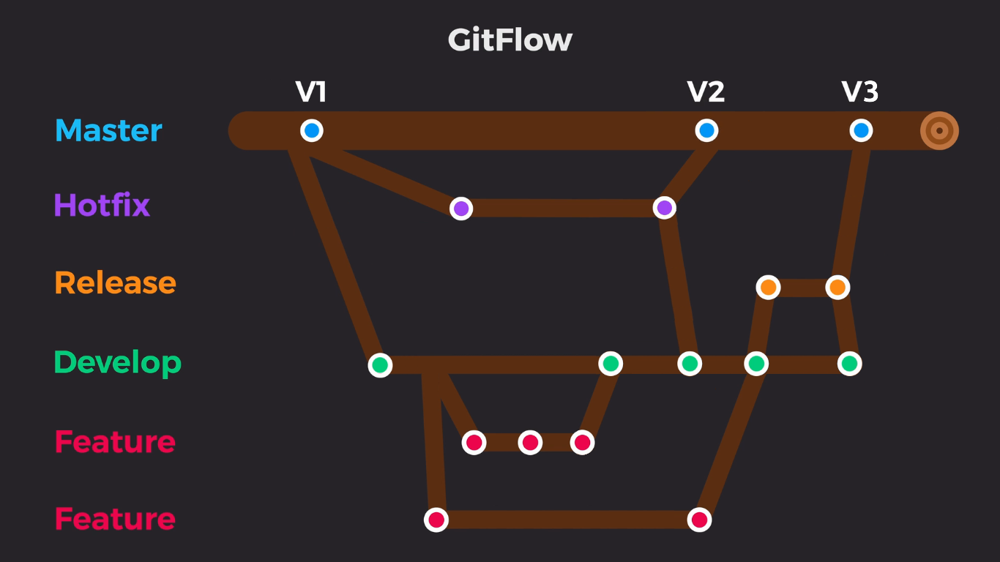

### Chapter10 – Git workflow

- References:
    - [Travaillez en équipe en utilisant un workflow](https://openclassrooms.com/fr/courses/5641721-utilisez-git-et-github-pour-vos-projets-de-developpement/6113111-travaillez-en-equipe-en-utilisant-un-workflow)
    - [Gitflow : est-il le workflow dont j’ai besoin ?](https://blog.engineering.publicissapient.fr/2018/03/28/gitflow-est-il-le-workflow-dont-jai-besoin/)
    - [Use a workflow to work as a team](https://openclassrooms.com/fr/courses/5671626-manage-your-code-project-with-git-github/6152311-use-a-workflow-to-work-as-a-team)
    - [Comparing Workflows](https://www.atlassian.com/git/tutorials/comparing-workflows)

A git workflow is a recommendation on how to use git. There exists several git workflows:
- Centralized Workflow
- Feature Branch Workflow
- Gitflow Workflow
- Forking Workflow

Let's focus on **GitFlow**:



#### Branch description

- **master**: code for production
- **hotfix**: correct small bugs that are on the master branch
    - created from master
    - merged into develop and master
- **develop**: centralizes new features
    - created from master
- **feature**: contains one feature
    - created from develop
    - merged into develop
- **release**: contains code that will be tested before putting on master 
    - created from develop
    - merged into develop and master

#### Install GitFlow

```
wget http://github.com/nvie/gitflow/raw/develop/contrib/gitflow-installer.sh
chmod +x gitflow-installer.sh
./gitflow-installer.sh
```

- Reference: [Fatal: Not a gitflow-enabled repo yet. Please run 'git flow init' first](https://stackoverflow.com/questions/36843062/fatal-not-a-gitflow-enabled-repo-yet-please-run-git-flow-init-first)

#### Initialize a GitFlow repository

```
mkdir my_repository
cd my_repository
git flow init # creates branches for us on top of initializing the repository
```

```
# follow instructions
```

```
git remote add origin https://github.com/DamienToomey/git_cheatsheet.git
git pull origin main # main is equivalent to master
```

#### Start a feature

```
git flow feature start firstfeature
```

Output:

>Summary of actions:  
\- A new branch 'feature/firstfeature' was created, based on 'develop'  
\- You are now on branch 'feature/firstfeature'
