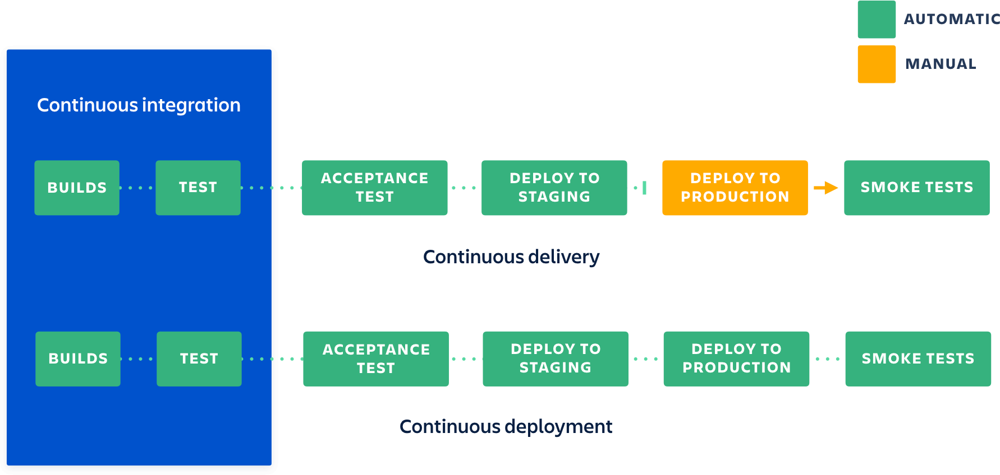

### Chapter11 – Continuous integration (CI) vs Continuous Delivery vs Continuous Deployment

- References:
    - [Utilisez le GitLab intégration continue (IC)](https://openclassrooms.com/fr/courses/5641721-utilisez-git-et-github-pour-vos-projets-de-developpement/6113136-utilisez-le-gitlab-integration-continue-ic)
    - [Continuous Integration vs. Continuous Delivery vs. Continuous Deployment](https://stackoverflow.com/questions/28608015/continuous-integration-vs-continuous-delivery-vs-continuous-deployment)
    - [Continuous integration vs. continuous delivery vs. continuous deployment ](https://www.atlassian.com/continuous-delivery/principles/continuous-integration-vs-delivery-vs-deployment)

```
Continuous Deployment = Continuous Integration + Continuous Delivery
```

"
- **Continuous Integration**: The practice of merging the development work with the main branch constantly so that the code has been tested as often as possible to catch issues early. [(automated tests)]

- **Continuous Delivery**: Continuous delivery of code to an environment once the code is ready to ship. This could be staging or production. The idea is the product is delivered to a user base, which can be QA's or customers for review and inspection.

Unit test during the Continuous Integration phase can not catch all the bugs and business logic, particularly design issues that is why we need QA, or staging environment for testing.

**Continuous Deployment**: The deployment or release of code as soon as it's ready. Continuous Deployment requires Continuous Integration and Continuous Delivery otherwise the code quality won't be guarantee in a release.
"



- Image reference: [Continuous integration vs. continuous delivery vs. continuous deployment ](https://www.atlassian.com/continuous-delivery/principles/continuous-integration-vs-delivery-vs-deployment)

#### Main tools

CI tools:
- Gitlab CI
- Jenkins
- Travis CI
- ...

Test coverage/vulnerabilities/bugs detection/maintainbility tool:
- SonarQube
- ...

Find other CI tools on the [Gihub marketplace](https://github.com/marketplace).

#### Add badges to README


- Image reference: [README-badges.md](https://gist.github.com/tterb/982ae14a9307b80117dbf49f624ce0e8)


 