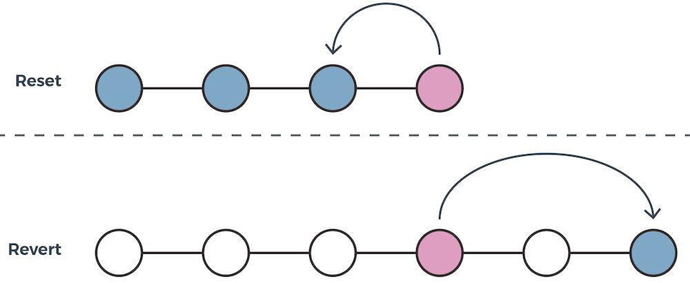

### Chapter6 – `git reset` vs `git revert`

- Reference: [Utilisez Git reset](https://openclassrooms.com/fr/courses/5641721-utilisez-git-et-github-pour-vos-projets-de-developpement/6113051-utilisez-git-reset)
- Reference: [Corrigez vos erreurs sur votre dépôt distant](https://openclassrooms.com/fr/courses/5641721-utilisez-git-et-github-pour-vos-projets-de-developpement/6113046-corrigez-vos-erreurs-sur-votre-depot-distant)

#### 

- `git reset` will revert to the previous state without creating a new commit
- `git revert` will revert to the previous state  by creating a new commit



- Image reference: [Utilisez Git reset](https://openclassrooms.com/fr/courses/5641721-utilisez-git-et-github-pour-vos-projets-de-developpement/6113051-utilisez-git-reset)

**WARNING**: `git revert` should be used when going back to a previous commit that has already been pushed on the remote repository in order to keep a coherent commit history.

#### `$ git reset`

- `git reset --soft 7fc9e224`: safest kind of reset. It allows you to go to a specific commit in order to see the code at that given moment or to create a branch from an old commit. It does not delete any files, any commits and does not create a detached HEAD 
- `git reset --mixed 7fc9e224`: goes back to a specified commit while **keeping** everything that happened after that particular commit
-  `git reset --hard 7fc9e224`: goes back to a specified commit while **erasing** everything that happened after that particular commit

`HEAD~` can also be used instead of the commit id to indicate the second to last commit in `git log`.

**WARNING**: by default `git reset` is equivalent to `git reset --mixed HEAD~`

##### Example1: Go back to a specific commit

i.e. make master branch point back to a specific commit

- Create scenario

```
git status # make sure you are on master branch and that branch is clean
touch temp1.txt
git add temp1.txt
git commit -m "Adding temp1.txt"
touch temp2.txt
git add temp2.txt
git commit -m "Adding temp2.txt"
```

- Go back to the second to last commit

```
git log # copy first 8 characters of commit id you want to go back to
git checkout 0125ca80 # WARNING: replace 0125ca80 with first 8 characters of commit id stored in clipboard
git checkout -b my_new_branch # give the name my_new_branch to the detached HEAD
git checkout main
git reset --hard my_new_branch
# We cannot do `git merge my_new_branch` because my_new_branch is behind master as my_new_branch corresponds to a previous commit.
# If you do `git merge my_new_branch` instead of `git reset --hard my_new_branch`, you will get "Already up-to-date"
git push
```

#### `$ git revert`

##### Example1: Revert a specified commit

- Create scenario

```
git status # make sure you are on master branch and that branch is clean
echo "Adding text" >> temp.txt
git add temp.txt
git commit -m "Adding text to temp.txt"
git push
```

- Solution

```
git log # copy first 8 characters of commit id to remove
git revert a1b78d10 # WARNING: replace ca83a6df with first 8 characters of commit id stored in clipboard
# to revert last commit, you can also use `git revert HEAD`
```

A text editor will a appear

```
# update commit message or leave it as is
```

```
# save content of text editor
```

```
# close text editor
```

```
git push
```