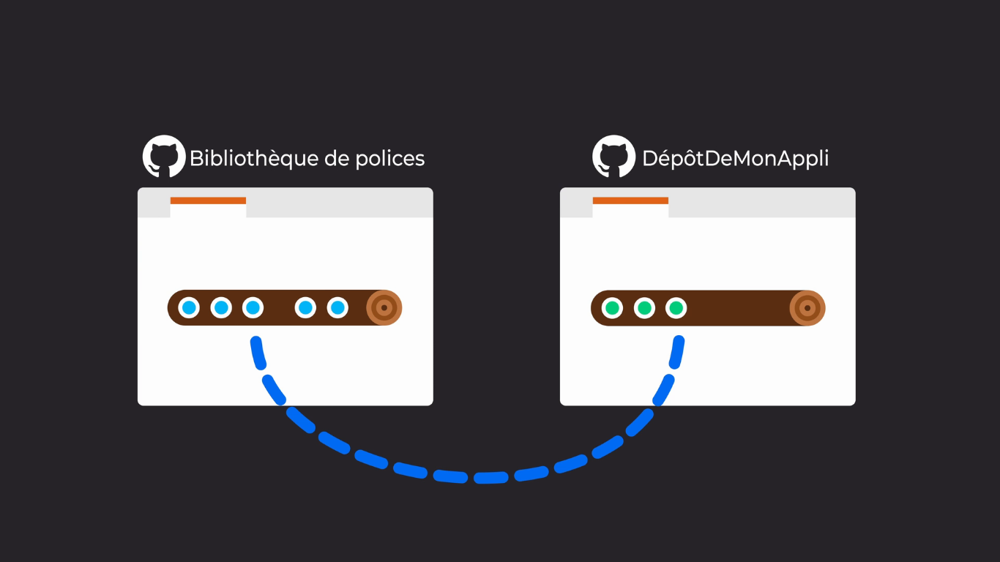

### Chapter8 – Integrate other people's repositories into yours with `git submodule` and `git subtree`

- References:
    - [Intégrez les dépôts d’autres personnes dans le vôtre](https://openclassrooms.com/fr/courses/5641721-utilisez-git-et-github-pour-vos-projets-de-developpement/6113091-integrez-les-depots-d-autres-personnes-dans-le-votre)
    - [Use subtrees and submodules to add a public repo to your project](https://openclassrooms.com/fr/courses/5671626-manage-your-code-project-with-git-github/6152286-use-subtrees-and-submodules-to-add-a-public-repo-to-your-project)

Submodules and subtrees allow you to add external repositories to your repository.

#### Submodule vs subtree

- `git submodule` creates a link to the latest commit of an external repository and clones it into your own repository. Changes in the external repository will not be automatically updated in your submodule. The update must be done manually.
- `git subtree` makes a copy of the external repository and associated commit history in your own repository. Changes in the external repository will not be automatically updated in your subtree. The update must be done manually.

The main difference between `git submodule` and `git subtree` is that after adding a submodule to your repository, your new commit does not contain the actual source code of that external repository but it contains a reference to it whereas after adding a subtree, your new commit contains the actual source code of that external repository. Thus when cloning a repository containing a submodule, you will have to initialize and update your submodules to create the linked references in the .gitmodules folder again. 

| Submodules | Subtree |
|:---:|:---:|
|  |  |
|  |  |
|  |  |
|  |  |

- Image reference: [Intégrez les dépôts d’autres personnes dans le vôtre](https://openclassrooms.com/fr/courses/5641721-utilisez-git-et-github-pour-vos-projets-de-developpement/6113091-integrez-les-depots-d-autres-personnes-dans-le-votre)

#### Submodule example

This following command adds the repository `git_cheatsheet`, as submodule, in a folder called `my_submodule`.

```
git submodule add https://github.com/DamienToomey/git_cheatsheet.git my_submodule
```

This will create the file `.gitmodules` that contains the description of submodules used in your project.

- Update submodule from its remote repository:

```
git submodule update
```

#### Subtree

- Add a subtree to your repository

```
git remote add my_subtree https://github.com/DamienToomey/git_cheatsheet.git
git subtree add --prefix=my_subtree/ my_subtree master --squash
```

Note: for the main repository and the subtree, we are using the master branch. 

- Update subtree from its remote repository:

```
git subtree pull --prefix=my_subtree/ my_subtree master
```