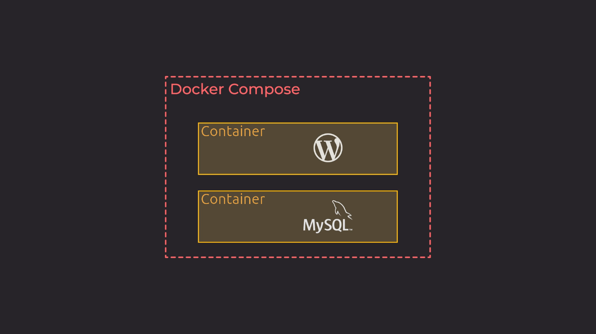

### Chapter6 – Docker Compose

- Reference: [Découvrez et installez Docker Compose](https://openclassrooms.com/fr/courses/2035766-optimisez-votre-deploiement-en-creant-des-conteneurs-avec-docker/6211624-decouvrez-et-installez-docker-compose)

Docker Compose allows you to describe in a YAML (.yml or .yaml) file, several containers as a set of services.

You can use Docker Compose to ochestrate the deployment of several containers and duplicate environments.



#### Install Docker Compose for Linux

```
sudo curl -L "https://github.com/docker/compose/releases/download/1.23.2/docker-compose-$(uname -s)-$(uname -m)" -o /usr/bin/docker-compose && sudo chmod +x /usr/bin/docker-compose
```

#### Check Docker compose version

```
sudo docker-compose --version
```

Output:

```
docker-compose version 1.23.2, build 1110ad01
```

#### Docker Compose CLI

The Docker Compose CLI is similar to the Docker CLI.

A **stack** is a set of Docker containers launched via a single docker-compose.yml file.

##### Build images in docker-compose.yml

```
sudo docker-compose build
```

##### Start a Docker Compose stack

```
sudo docker-compose up -d
# -d, --detach: Detached mode: Run containers in the background
```

**WARNING**: `sudo docker-compose up` never rebuilds an image

##### Status of Docker Compose stack

(Check if each container in the stack is working)

```
sudo docker-compose ps
```

##### Show logs of a Docker Compose stack

```
sudo docker-compose logs -f --tail 5
# --tail 5 to display last 5 lines of the logs
```

##### Stop a Docker Compose stack

```
sudo docker-compose stop
# WARNING: does not delete ressources created by Docker Compose (see `docker-compose down`)
```

##### Destroy ressources created by Docker Compose 

```
sudo docker-compose down
```

##### Check syntax of docker-compose.yml file

```
sudo docker-compose config
```